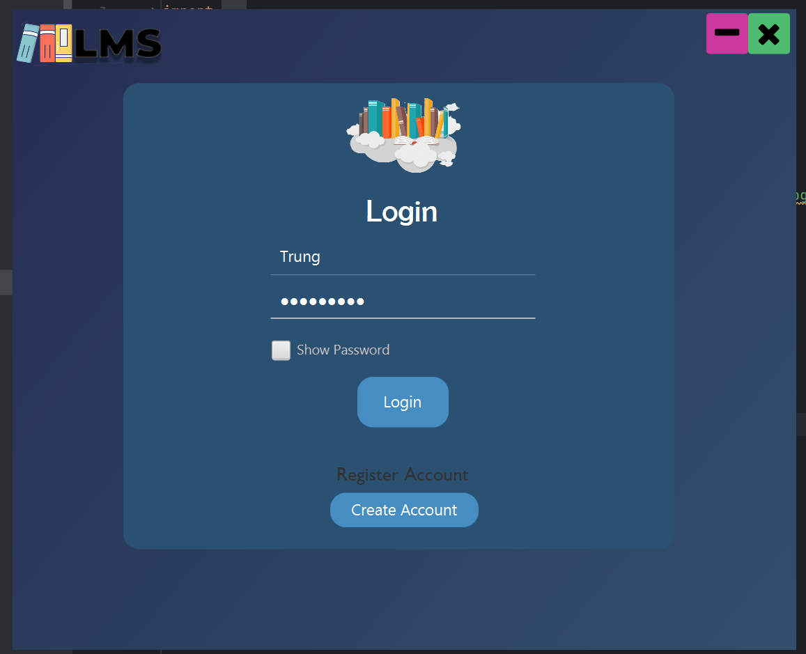
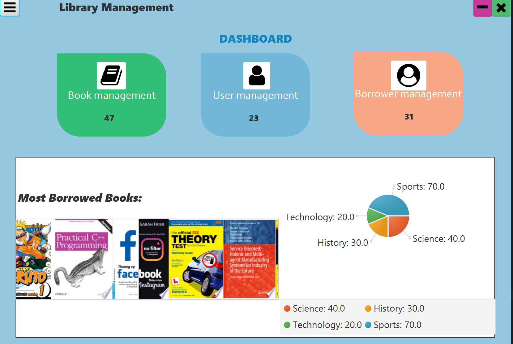
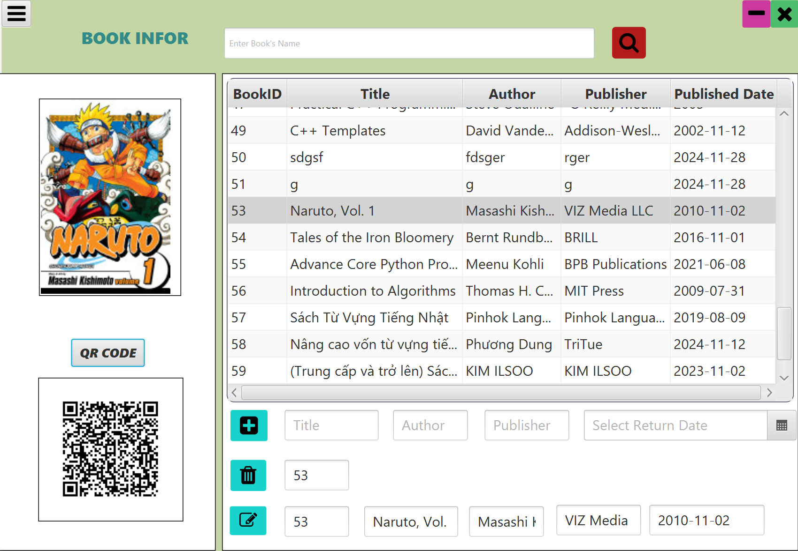
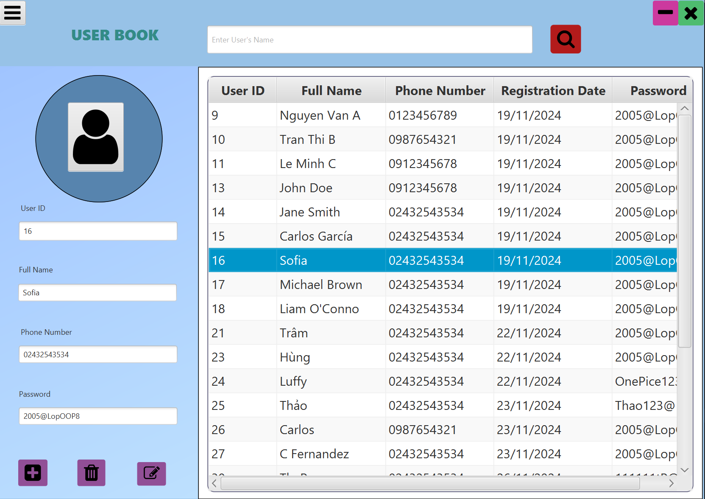
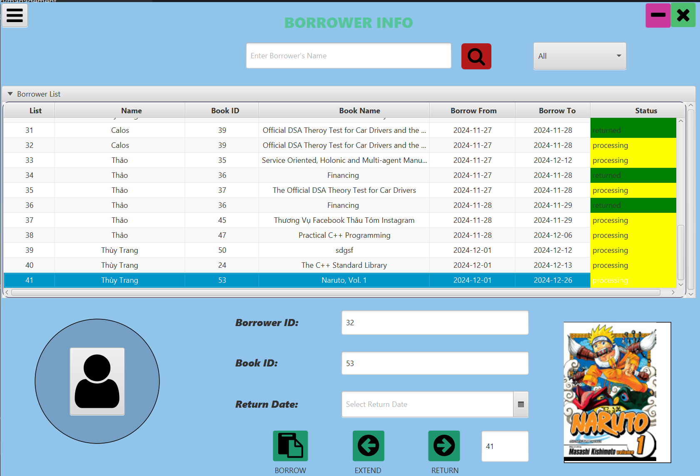
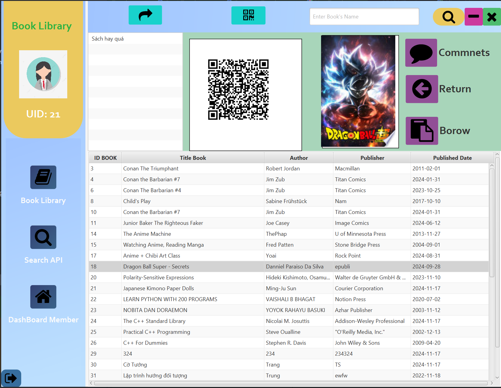
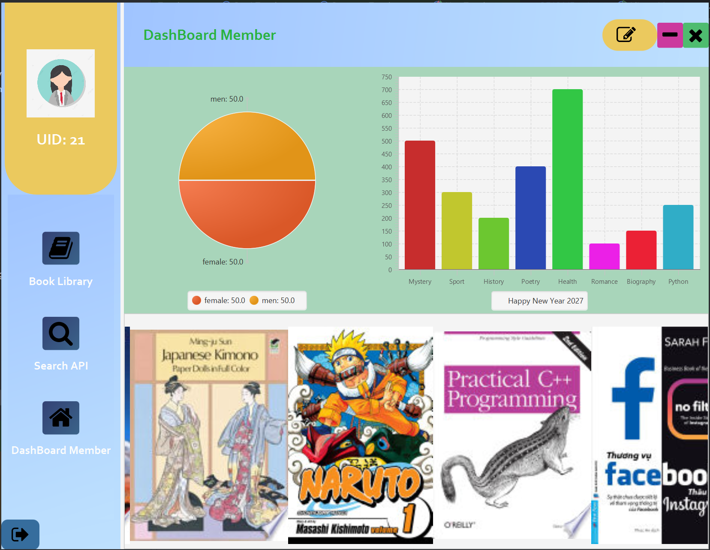

# Library Management System

This is a **Library Management System** developed in **JavaFX**, designed to streamline the process of managing library documents, members, and transactions like borrowing and returning books. The system supports a user-friendly interface with various functionalities, including automatic document information fetching from APIs, QR code generation for book transactions, and more.

## Features

- **Document Management**:
  - Add, edit, and delete books/documents in the library.
  - Automatically fetch document information (such as title, author, and publication date) from the **Google Books API** using ISBN or title.
  
- **Member Management**:
  - Add, edit, and delete library members.
  - Track borrowing history and current status of books borrowed by members.

- **Borrowing and Returning**:
  - Borrow and return books with automatic tracking of overdue books and fines.

- **QR Code Generation**:
  - Generate QR codes for books and transactions which link directly to document details or member profiles.

- **Multithreading**:
  - Efficiently handle heavy tasks, such as fetching data from external APIs or managing large databases, using multithreading to improve performance and responsiveness.

- **SQLite Database**:
  - An embedded **SQLite** database for storing information about documents, members, and transactions, making it lightweight and easy to distribute.
## Login

## Admin Section

- Library Books Page:

  - Displays the list of books available in the library.
  - Includes options to add, edit, or delete books and a search bar for quick lookups.
Image Suggestion: A table with book details like title, author, and action buttons (edit/delete).
  

- Library Members Page:

  - Shows the list of library members with options to manage their profiles.
  - Includes fields for name, contact info, and borrowing history.
Image Suggestion: A table of member details with buttons for adding or managing members.


- Borrowing and Returning Management:

  - Displays a dashboard for tracking ongoing borrow transactions and overdue returns.
  - Includes fine calculation and transaction status updates.
Image Suggestion: A transaction table showing member names, book titles, due dates, and actions (return/update).


- Search Books via API:

  - Allows fetching book details from the Google Books API by entering an ISBN or title.
  - Image Suggestion: A form with input fields for ISBN/title and an auto-filled preview of book data retrieved.


## User Section
- User Return Books Page:

  - Lists available books for borrowing with filters (e.g., by genre, author, availability).
  - Allows users to select and request to borrow a book.
Image Suggestion: A grid layout of book covers with titles and "Borrow" buttons.


- User Borrow Books Page:

- Displays the books currently available for borrowing by the user.
- Includes options to search for books, filter by genre or author, and initiate a borrowing request.
- Shows details like the book title, author, and availability.


Book Comment Page:

Allows users to write and view comments or reviews for books.
Image Suggestion: A book detail page with a section for user reviews and a text box for adding comments.


User Home Page:

Displays a personalized homepage for users, including recommended books and quick access to borrow/return pages.
Image Suggestion: A homepage with a banner, a list of recommended books, and navigation links.



## Technologies Used
- **JavaFX**: Used for building the graphical user interface (GUI).
- **FXML**: XML-based language for defining the layout and structure of the JavaFX UI.
- **SQLite**: A lightweight, serverless database engine used to store the system data locally.
- **Google Books API**: Fetches book details such as title, author, and description using ISBN or book title.
- **Multithreading**: Handles operations like fetching API data in the background to improve system performance and avoid UI freezing.
- **Design Pattern**: The project implements the **Singleton Design Pattern** for managing the database connection..

## Setup Instructions

### Prerequisites

To run this project, you need:

- **Java 11 or higher**: Ensure that you have JDK 11 or above installed on your machine.
- **SQLite**: The database is embedded within the project, so no external installation is needed.
- **IDE**: You can use any Java IDE such as IntelliJ IDEA, Eclipse, or NetBeans with JavaFX support.

### Clone the repository

To get started, clone the repository to your local machine:

```bash
https://github.com/kimmttrung/OOP_Library_Management_Project01.git
```
## Build and Run

### Open the Project:
- Open the project folder in your preferred IDE (such as IntelliJ IDEA or Eclipse).

### Set Up JavaFX:
- Ensure that you have JavaFX libraries correctly configured in your project.
- If you're using IntelliJ IDEA, you can follow the [JavaFX setup instructions for IntelliJ](https://openjfx.io/openjfx-docs/#intellij) to set up the required libraries.

### Database Setup:
- No external database setup is needed. The project uses **SQLite** as an embedded database, and the system will **automatically create the database file** upon the first run.

### Compile and Run:
- After setting up JavaFX, compile the project and run the main class `Main.java`.
- This will launch the application window.

---

## Database Setup

### Automatic Database Creation:
- When you first run the application, an **SQLite** database file named `library.db` will be automatically created in the project directory if it does not already exist.
- The database stores all documents, members, and transaction data.

### Database Structure:
- **Tables**: The database will contain tables like `documents`, `members`, and `transactions` to store the relevant data.
- **Data**: The system will populate the database with book and member data as you use the application.

### Database Management:
- You can use any SQLite management tool (e.g., **DB Browser for SQLite**) to view or modify the database manually if needed.

---

## Usage

### Document Management

#### Adding a New Book:
- Navigate to the **Add Document** section.
- You can manually enter book details such as title, author, and ISBN.
- Alternatively, use the **Fetch from API** button to automatically retrieve book information from the **Google Books API** by entering the ISBN or title.

#### Editing or Deleting a Book:
- From the **Manage Documents** section, you can view a list of books in the library.
- You can edit book details or remove books from the system as needed.

### Member Management

#### Add, Edit, or Delete Members:
- In the **Manage Members** section, you can add new members, edit their details, or delete members who are no longer part of the library.
- You can track each member's borrowing history and current status.

#### Member Details:
- Each member has a profile that includes details such as name, contact information, and borrowing history.

### Borrowing and Returning Books

#### Borrowing Books:
- To borrow a book, select a member and a book from the available list.
- When the transaction is confirmed, the book will be marked as borrowed, and the member's borrowing history will be updated.

#### Returning Books:
- When a book is returned, its status will be updated to available, and the due date and fines (if any) will be calculated and shown.

#### Overdue Books:
- The system tracks overdue books and calculates fines based on the number of days a book is overdue.

### QR Code Generation

#### Generate QR Codes:
- For each document or member, you can generate a **QR Code**.
- The QR Code contains information like the book's details or the member's profile, which can be scanned to quickly access relevant data.

#### Scanning QR Codes:
- Use the integrated scanner to scan the QR codes for members and books to quickly retrieve data or perform transactions.

---

## Contributing

We welcome contributions to improve the Library Management System. You can:
- Fork the repository to your own account.
- Submit a pull request for bug fixes or new features.
- Report issues using the "Issues" tab on the repository.

### Code Style
- Follow Java's standard coding conventions.
- Ensure your code is well-commented to explain complex logic.
- Write unit tests for new features or fixes.

---
